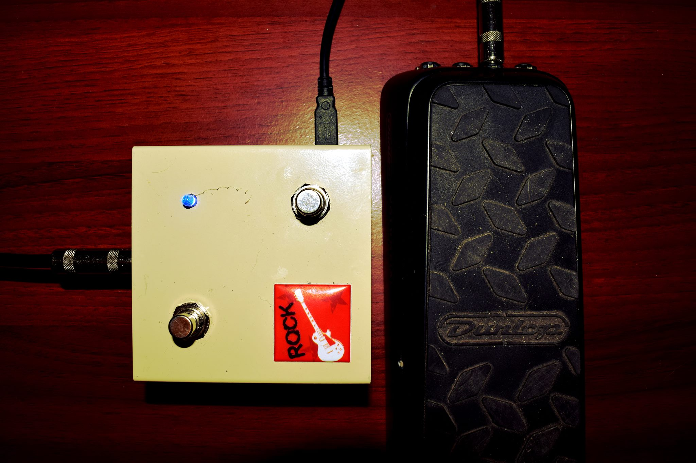

# EA-Expr2MIDI

USB Expression to MIDI interface.\
Cheap and useful.

&nbsp;
## Features
* Converts the signal from the expression pedal (or any similar variable resistor) to MIDI data (Control Change messages).

* The two buttons are to change (+/-) the number of CC# (0-127).

* Standalone, it is recognized as a USB interface and is powered from the same port.

* It comes with its software to see the CC Value and CC# on the screen.

&nbsp;
